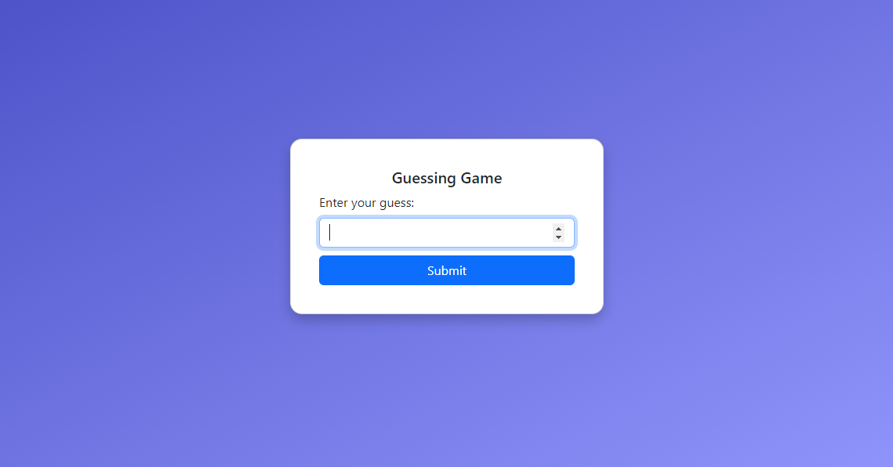
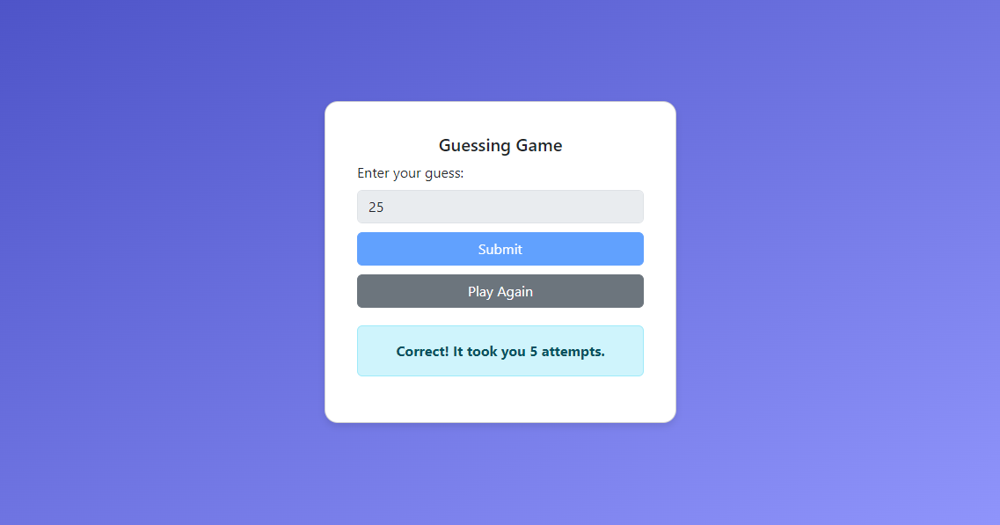

# PRODIGY_SD_02
Guessing Game (Number)

## Task 2: Guessing Game Application

### Objectives:
Develop a user-friendly guessing game application that challenges users to guess a randomly generated number within a specified range. The application should provide real-time feedback on each guess and display the number of attempts taken to guess the correct number.

### Requirements:
1. Generate a random number within a predefined range.
2. Prompt the user to input their guess through a graphical user interface (GUI).
3. Compare the user's guess to the generated number and provide feedback (too high, too low, or correct).
4. Continuously prompt the user until they guess the correct number.
5. Display the number of attempts it took to guess the correct number once the game is won.

### Languages and Tools:
- JavaScript (using HTML/CSS for GUI in combination with frameworks like React and React-Bootstrap)

### Visualization:

### Deployment:

You can access the deployed Temperature Conversion Program here, [Guessing Game](https://prodigy-sd-02.vercel.app/).
